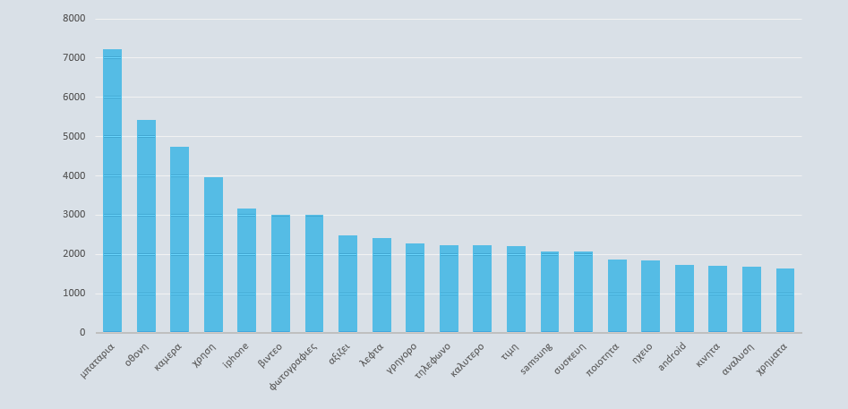

# Multi-Criteria Smartphone Recommendation System

This project is part of a **Diploma Thesis** submitted to the **Technical University of Crete (TUC)**.  
You can access the thesis here: [TUC Digital Library – Multi-Criteria Smartphone Recommendation System](https://dias.library.tuc.gr/view/92456)

This is a complete end-to-end platform for recommending smartphones tailored to the Greek market. It combines:

- Web scraping of smartphone specs and user reviews  
- Topic modeling (LDA) to extract latent themes from reviews  
- Multi-Criteria Decision Analysis (MCDA) using UTA-based methods  
- Personalized recommendations based on user-defined preferences and constraints

---

## System Components

### 1. DataRetriever – Web Scraping Engine

Scrapes specifications and user reviews for smartphones from Greek e-commerce sources.

**Tech Stack**: Python, Selenium, BeautifulSoup

**Input**: `UrlKinhtwn.txt` (URLs of product pages)  
**Output**: `kinhta25.xlsx` (Excel with two sheets: specs + reviews)

**Features**:
- Custom parsers for specs like CPU, RAM, screen size, etc.  
- Robust extraction of Greek-language review text  
- Multi-sheet Excel export

---

### 2. LDA – Topic Modeling of Review Text

Performs Latent Dirichlet Allocation (LDA) to uncover recurring topics in user reviews.

**Libraries**: Gensim, NLTK, pyLDAvis, Levenshtein  
**Input**: `kinhta25.xlsx`, `stopwords_el.txt`  
**Output**: 
- `LDA_clusters.xlsx` with topic assignments
- Visualizations saved in the `Screenshots/` folder

#### Visual Examples

**Most common words after cleaning**  


**LDA topic clusters (pyLDAvis output)**  


**Top words per topic with probability**  


---

### 3. Agent_Allocator – Personalized Recommendation Engine

Allocates smartphones to users based on preference matching and constraints.

**Input Excel Files**:
- `Apaithseis_Xrhsth.xlsx`: User preferences
- `kritiria.xlsx`: Weights for each decision criterion
- `xarakthristika_kinhtwn.xlsx`: All available smartphone specs
- `dedomena_apokleismou.xlsx`: Brand or model exclusions

**Logic**:
- Applies user-defined weights to key features  
- Computes overall compatibility scores  
- Filters based on brand, feature, or price constraints  
**Output**: Ranked smartphone recommendations

---

### 4. Utastar Utilities Calculator – UTA-Based MCDA Engine

Implements UTA, UTASTAR, and UTADIS algorithms to evaluate products across multiple criteria.

**Main Script**: `UtastarUtilitiesCalcuator.py`  
**Helper Modules**:  
- `utamethods.py`, `utautastarfunctions.py`, `utadisfunctions.py`, `filters.py`  
- Tutorial notebook: `MultiCrit-tutorial.ipynb`

**Inputs**:
- `xarakthristika_kinhtwn.xlsx`: Smartphone characteristics  
- `bathmologies_kinhtwn_sunolou_agoras.xlsx`: Market-wide ratings  
- `bathmologies_kinhtwn_sunolou_anaforas.xlsx`: Reference product ratings  

**Output**: `Results.xlsx` with calculated utilities and rankings

---

## Data Flow Diagram


---

## Folder Structure

```bash
.
├── Agent_Allocator/
├── DataRetriever/
├── LDA/
├── UtastarUtilitiesCalcuator/
├── Screenshots/
│   ├── MostCommonWords.png
│   ├── LDA Clusters.png
│   ├── LDA Cluser Words.png
├── Διάγραμμα Δεδομένων.png
├── README.md
